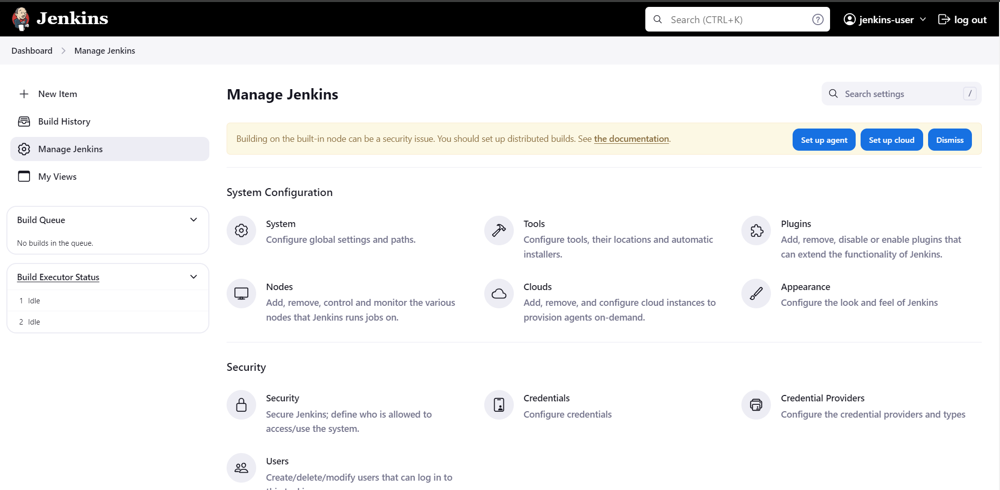
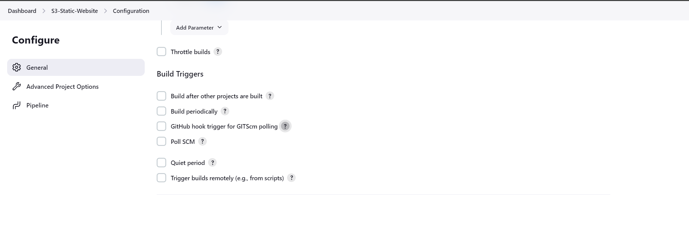

# Set up a CI/CD pipeline with Jenkins to host an AWS S3 static website

## Introduction

In this project, I'll be creating a CI/CD pipeline using Jenkins to deploy a static website. Specifically, I'll utilize Terraform to provision an AWS S3 bucket and configure it to host the static website.

## Prerequisites
Before getting started, ensure that the following prerequisites are in place:
1. A text editor (e.g. Visual Studio Code).
2. Jenkins installed. (Instructions for deploying Jenkins on an AWS EC2 instance can be found at: [Link](https://github.com/Glen-Poh/Jenkins-Server-EC2) )

## Configuration Files

### Terraform Files

1. **provider.tf**: This file contains the provider definition (AWS) and the region(us-east-1) for the architecture setup.

2. **s3bucket.tf**: This file contains the configuration code for setting up the S3.
   
3. **output.tf**: This file contains the output for the S3 bucket website endpoint.

### HTML

1. **index.html**: A simple HTML template file to demonstrate the functionality of the static website.

2. **error.html**: This page is displayed in case of any errors encountered with the static website.

### Jenkinsfile

A text file that define the Jenkins pipeline to deploy the S3 bucket.

#### Pipeline Stages
1. Checkout from SCM: Checkout the Jenkinsfile and Terraform script for the git repo

2. Terraform init: To initialize the Terraform. This stage is skipped if the user selects 'terraform destroy'.

3. Terraform plan: Create a plan for apply or destroy.

4. Terraform apply/destroy: User will need to review the plan at the previous stage and provide approval before this stage is triggered. This stage would be either apply or destroy base on the user selection. 

## Getting Started

### Cloning from the repository

Open Git Bash and change the current working directory to the location where you want the cloned directory to be.
```
cd '/c/Users/YOUR USERNAME HERE/YOUR FOLDER HERE'
git clone https://LINKFROMGITHUB
```

### Jenkins setup
#### Setting up credentials

To provide Jenkins with the access to AWS, ensure that you have created an IAM user with an access ID and key. I have given AdministratorAccess to this IAM user. Click Manage Jenkins > Credentials.



In the 'New Credential' section, change the 'Kind' to 'Secret Text' and enter the Access Key ID and Access Key Secret.


You should have 2 credential entered under the global credential.


#### Creating Pipeline

On the Jenkins homepage, click on 'New Item' or 'Create a Job'. Enter your project name, select 'Pipeline', and then click 'OK'


Enable 'This project is parameterized', then add a parameter named 'action', and provide 'apply' and 'destroy' as choices for this parameter.


If you want your pipeline to automatically trigger when there's an update to the Git repo, ensure to select 'Poll SCM'. However, for this project, I did not choose this option.



In the Pipeline Definition section, choose 'Pipeline script from SCM', then enter the repository URL.

######################## Placeholder ###################################

In the 'Branch Specifier' field, change it to */main, and in the 'Script Path' field, enter Jenkinsfile.


After saving the pipeline, navigate to the sidebar and click 'Build with Parameters'. Then, under 'action', select 'apply'.


The pipeline will run and pause at the Terraform apply/destroy stage. Approval is necessary before proceeding to the Terraform apply stage. Users must review the logs generated during the Terraform plan stage and provide their approval. See run #2 from the image below.


Once reviewed, click 'Approve', and the pipeline should resume. You should observe the pipeline's successful execution.


## Results

After successful execution of the pipeline, you will be able to view the created S3 bucket, along with both the index.html and error.html files contained within.


Visit the S3 website endpoint and you should be able to view the html page.


The S3 static website is succefully deployed via a Jenkins pipeline.

## Testing

I've updated the HTML file with "Hello again!" and pushed it to the GitHub repository.


Run the Jenkins pipeline line again to apply these update.


The static website should be updated with the changes.


If there is any error, the error.html should appear.


## Deleting the infrastructure

To remove the S3 bucket deployed via the Jenkins pipeline, click 'Build with Parameters' and select 'destroy' under the action.


If the 'destroy' parameter is selected, the pipeline will skip 'terraform init' and trigger 'terraform apply -destroy' under the Terraform plan stage.


Review the destroy plan and click 'Approve' to allow the pipeline to continue.


<br>
Verify that the S3 bucket has been removed using the AWS console.
<br><br>
If you are no longer using the Jenkins Server, remember to delete it too.